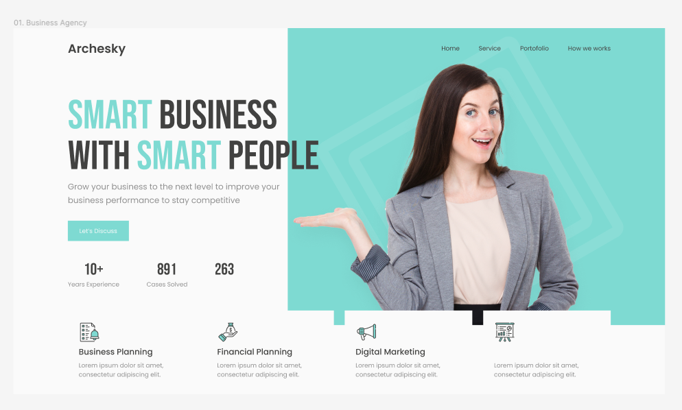
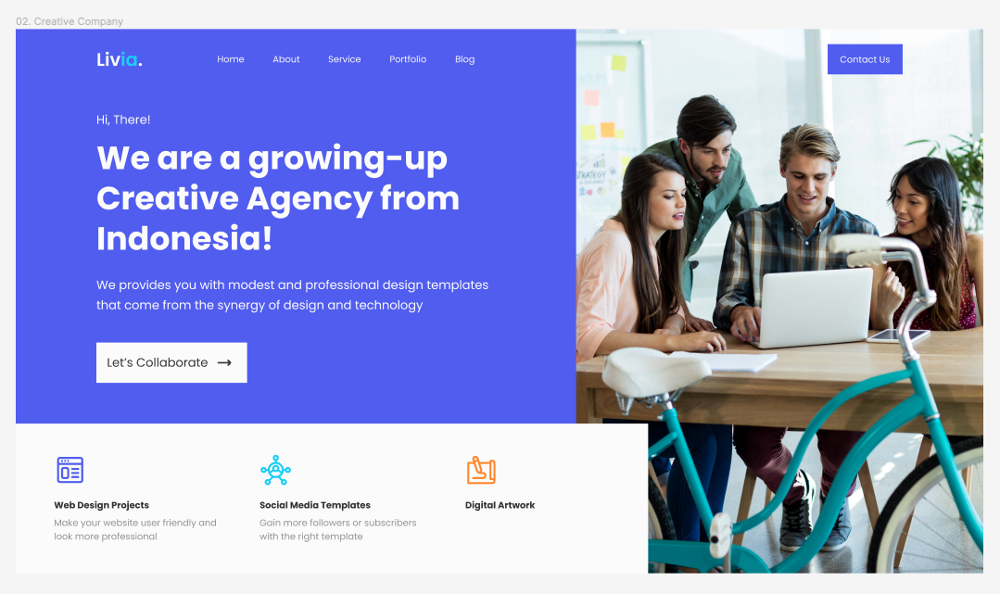

# HTML-CSS-Header-Samples

¡Bienvenido! 🚀 HTML-CSS-Header-Samples es una colección de 5 impresionantes encabezados diseñados exclusivamente con HTML y CSS.

## Sobre el Proyecto

Este proyecto demuestra mi habilidad para diseñar encabezados atractivos y profesionales utilizando HTML y CSS. Cada uno de los 5 headers presenta un enfoque único y está diseñado para captar la atención y proporcionar una experiencia visual impactante.

## Visualización para Pantallas de 1290px

Estos encabezados están cuidadosamente diseñados para ofrecer una experiencia visual óptima en pantallas con una resolución de 1290px. Esta decisión de diseño garantiza que los elementos visuales y la disposición del contenido se presenten de manera atractiva y efectiva en pantallas de este tamaño. 🖥️

Aprovecha al máximo estas demostraciones explorando los encabezados en un entorno de 1290px para apreciar completamente su diseño y detalles visuales. 🌈✨

### Cómo Usar 🛠️

1. Clona o descarga este repositorio.
2. Navega a la carpeta "Header1", "Header2", "Header3", "Header4" o "Header5".
3. Abre el archivo "index.html" en tu navegador para visualizar el encabezado.
4. Haz clic en  para ver el código HTML o en  para ver el código CSS.

---

## Header1: Business Agency

### Descripción 📝

Este encabezado está diseñado para una agencia de negocios, destacando un H1 llamativo y un diseño limpio y profesional. Incluye un navegador de fácil navegación y varios apartados de artículos para presentar información clave de manera organizada.

### Características Principales 🌟

- **H1 Llamativo:** Un título principal atractivo para captar la atención.
- **Diseño Profesional:** Estructura limpia y profesional adecuada para una agencia de negocios.
- **Navegador de Fácil Navegación:** Facilita la exploración del contenido.
- **Apartados de Articles:** Secciones organizadas para presentar información clave.

---

## Header2: Creative Company

### Descripción 📝

¡Bienvenido a Creative Company, donde la creatividad se encuentra con la innovación! 🎨✨ Este encabezado está diseñado para impulsar la presencia en línea de tu empresa creativa de una manera única y cautivadora. Aquí hay algunas características clave que harán que te enamores:

- **Navegador Intuitivo:** 🚀 Facilita la exploración con nuestra barra de navegación intuitiva, asegurando que tus visitantes naveguen con facilidad por tu contenido.
- **Botón de Contacto:** 💬 Destaca y conecta con tus clientes potenciales mediante nuestro botón de contacto llamativo. Hacer negocios nunca fue tan sencillo.
- **H1 Claro y Atractivo:** 🔥 Captura la atención con nuestro título principal claro y atractivo. Establece el tono y deja una impresión duradera.
- **3 Articles Destacados:** 📚 Presentamos información clave de manera atractiva en tres artículos destacados. Mantén a tus visitantes informados y comprometidos.
- **Imagen Llamativa de Estudiantes:** 🌟 Inspira confianza y creatividad con nuestra imagen representativa de estudiantes comprometidos. Transmitimos la esencia de tu empresa de manera visual.

## Contribuciones 🤝

¡Contribuciones y sugerencias son bienvenidas! Siéntete libre de abrir problemas, solicitudes de extracción o participar en la mejora de estos ejemplos.

## Trabajo Freelance 💼

Estoy disponible para trabajar en proyectos de diseño web, ya sea para particulares o empresas. Si necesitas ayuda con el diseño de tu sitio web o tienes algún proyecto en mente, ¡no dudes en contactarme en 
 

## Licencia 📜

Este proyecto está bajo la licencia [Nombre de la Licencia] - Consulta el archivo [LICENSE](LICENSE) para más detalles.
